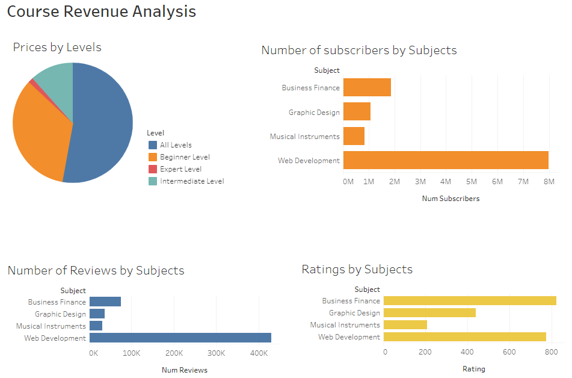
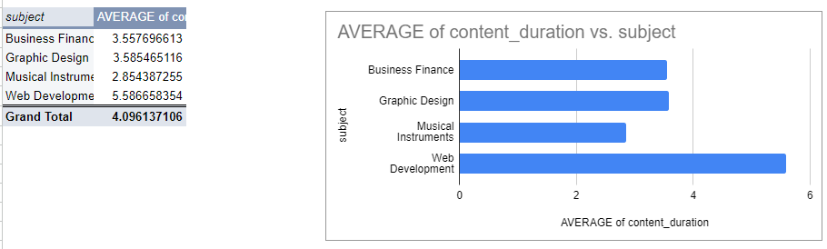
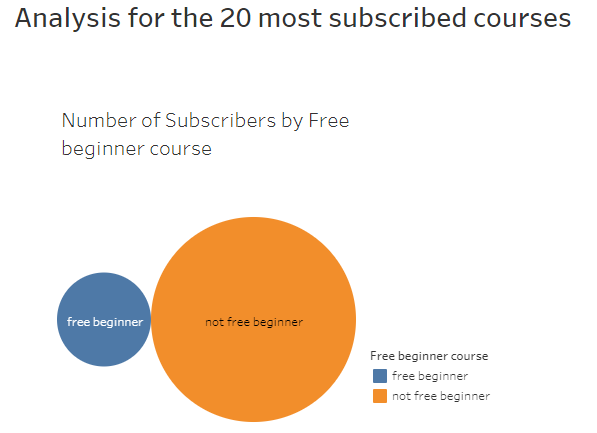

# Analyzing Course Performance to Drive Business Growth

---

## Project Overview

This data analysis project aims to provide actionable insights for increasing revenue at Udemy, an Education Tech Company. By analysing various course topics, the project seeks to identify opportunities to enhance revenue and track the performance of different courses over time.

## Data Sources

The dataset used for this analysis was downloaded from [Kaggle](https://www.kaggle.com/datasets?search=udemy+courses+dataset)

## Tools

1. **Google Sheets**: Used for data consolidation and cleaning.
2. **Tableau**: Used for data analysis and visualization to present the findings.

## Data Design / Cleaning / Preparation

The dataset used for the analysis covers four subject areas: Web Development, Graphic Design, Business Finance, and Musical Instruments. The goal is to identify potential revenue growth opportunities and track performance across these topics. Data from multiple sources were presented in different Excel sheets according to their subjects. I consolidated and cleaned the data in Google Sheets by removing duplicates and blank cells. The clean dataset was then analyzed in Tableau, where necessary visualizations were created to derive insights and track course performance.

## Data Visualizations and Findings

### Explore and interact with the rest of my visuals

Spreadsheet analysis. Click [here](https://docs.google.com/spreadsheets/d/166CQ_g1O_U538lHiDqF0azIW6uR78zDeg0UvCf4mIE4/edit?usp=sharing)

Tableau report. Click [here](https://public.tableau.com/views/AnalyzingCoursePerformancetoDriveBusinessGrowth_/Dashboard1?:language=en-US&:sid=&:redirect=auth&:display_count=n&:origin=viz_share_link)

Analysis on 20 Most subscribed Courses. Click [here](https://public.tableau.com/views/AnalyzingCoursePerformanceFor20mostsubscribedcourses/Dashboard1?:language=en-US&:sid=&:redirect=auth&:display_count=n&:origin=viz_share_link)

## Conclusion / Recommendation

The analysis of course revenue is crucial as it enables informed decision-making based on historical data. From the analysis performed, the following recommendations are made:
- Upgrade some of the free Web Development courses to paid courses, especially those with a higher number of lectures and reviews. Additionally, consider increasing the fees for some existing paid courses.
- Focus on Business Finance courses, as they are the second most subscribed after Web Development courses.
- Increase the fees for "All Level" and "Beginner Level" courses, as they are more subscribed compared to Intermediate and Expert Level courses.

These recommendations are based on current subscription trends and course performance data, aimed at optimizing revenue growth for Udemy.
